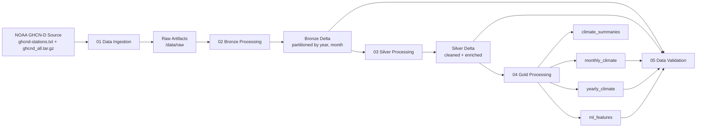

# GHCN-D ETL Project


-1565C0)

Production-style, medallion ETL pipeline for NOAA GHCN-D daily observations, scoped to Georgia (GA), built with Databricks + PySpark + Delta Lake.

The pipeline is designed to solve a specific engineering problem: turning fixed-width, station-level climate records into validated analytical tables and ML-ready features while preserving lineage from raw ingest through downstream artifacts.

## Overview

This repository implements a 5-stage notebook workflow:

1. Ingest NOAA source artifacts and extract Georgia station files.
2. Parse fixed-width `.dly` records into a normalized Bronze Delta table.
3. Clean, unit-normalize, pivot, and enrich into Silver.
4. Build Gold analytical marts and feature tables.
5. Run quality, completeness, schema, and lineage validations.

Why this design exists:

- The source format is compact but non-analytical (fixed-width lines, multi-day row encoding).
- Medallion layering isolates concerns: parse fidelity, data quality enforcement, then analytics/ML serving.
- Explicit validation notebook creates an auditable quality gate before consumption.

## Architecture



## Project Structure

```text
GHCN-D ETL Project/
|-- config/
|   `-- pipeline_config.yaml
|-- notebooks/
|   |-- 01_data_ingestion.py
|   |-- 02_bronze_processing.py
|   |-- 03_silver_processing.py
|   |-- 04_gold_processing.py
|   |-- 05_data_validation.py
|   `-- logs/
|       |-- 01.output
|       |-- 02.output
|       |-- 03.output
|       |-- 04.output
|       `-- 05.output
|-- scripts/
|   `-- setup.py
|-- src/
|   |-- ingest/
|   |   |-- data_downloader.py
|   |   `-- file_extractor.py
|   |-- transform/
|   |   |-- bronze_processor.py
|   |   |-- silver_processor.py
|   |   `-- gold_processor.py
|   `-- utils/
|       |-- config_loader.py
|       |-- data_validator.py
|       |-- schema_definitions.py
|       `-- spark_utils.py
`-- README.md
```

## Data Source

The pipeline consumes official NOAA GHCN-D artifacts over HTTPS:

- Stations metadata: `https://www.ncei.noaa.gov/pub/data/ghcn/daily/ghcnd-stations.txt`
- Daily archive: `https://www.ncei.noaa.gov/pub/data/ghcn/daily/ghcnd_all.tar.gz`

Configured filters in `config/pipeline_config.yaml`:

- `target_state = GA`
- `start_year = 2015`
- `end_year = 2025`
- Required core elements: `TMAX, TMIN, PRCP, SNOW, SNWD`

Why these filters exist:

- Reduce national-scale source volume to a clear geographic scope.
- Keep transformations and validation bounded and reproducible.
- Focus feature engineering on meteorological variables useful for climate analytics and ML baselines.

## Medallion Layers (What + Why)

### Bronze

What it does:

- Parses fixed-width `.dly` lines.
- Explodes day-wise values (31-day blocks) into row-level observations.
- Persists raw structured weather elements in Delta.

Why it exists:

- Preserves raw measurement granularity and metadata flags (`MFLAG`, `QFLAG`, `SFLAG`).
- Creates a stable, queryable source-of-truth for all downstream layers.

### Silver

What it does:

- Filters to required elements.
- Converts unit-scaled values to analytical units (e.g., tenths to decimal).
- Nulls out invalid extreme values.
- Pivots weather elements to columns and joins station metadata.

Why it exists:

- Converts parsing output into domain-ready daily records.
- Centralizes quality logic before any business/analytics aggregate.
- Provides one conformed daily climate table for both BI and ML feature generation.

### Gold

What it does:

- Produces four serving datasets:
  - `monthly_climate`
  - `yearly_climate`
  - `climate_summaries`
  - `ml_features`

Why it exists:

- Separates analytic use cases (trends, climatology, extremes, model features).
- Avoids recomputing expensive aggregations repeatedly.
- Publishes model-oriented features aligned to station-date grain.

## Feature Engineering (What + Why)

Implemented in `src/transform/gold_processor.py`:

- Lag features (`tmax_lag1`, `tmin_lag1`, `prcp_lag1`): capture short-term persistence effects.
- Rolling windows (`tmax_7day_avg`, `tmin_7day_avg`, `prcp_7day_sum`): smooth day-level noise and encode weekly context.
- Derived thermodynamic feature (`temp_range`): approximates diurnal variability.
- Seasonal encodings (`month_sin`, `month_cos`): preserve cyclic time behavior without discontinuity at year boundaries.
- Monthly anomalies (`tmax_anomaly`, `tmin_anomaly`, `prcp_anomaly`): represent deviation from station-month normals rather than absolute values.

These choices make the final feature set usable for forecasting/regression/classification experiments without requiring consumers to rebuild temporal context features.

## Validation

`notebooks/05_data_validation.py` performs:

- Schema checks for Bronze and Silver.
- Completeness checks for key weather elements.
- Temperature/precipitation anomaly and consistency checks.
- Cross-layer lineage checks (record and station counts).
- Partition/file footprint checks.

Validation intent:

- Detect parse or transformation regressions quickly.
- Keep quality drift visible in measurable terms.
- Ensure downstream users can trust both schema and volume expectations.

## Results (From Logged Artifacts)

All values below come directly from notebook output artifacts in `notebooks/logs/*.output`.

### Ingestion and Bronze

- GA stations identified: `1407`
- GA station files extracted: `913`
- Bronze total records: `4,482,432`
- Bronze unique stations: `913`
- Bronze date range: `2015-2025`
- Missing Bronze values (`VALUE is null`): `0`

### Silver Quality Snapshot

- Silver total records: `1,541,046`
- Silver unique stations: `912`
- Silver date range: `2015-01-01` to `2025-07-17`
- Completeness:
  - `TMAX`: `27.9%`
  - `TMIN`: `27.9%`
  - `PRCP`: `91.9%`
  - `SNOW`: `54.7%`
  - `SNWD`: `18.5%`
- Temperature anomalies (validation notebook): `36`
- Extreme precipitation events (`PRCP > 100mm`): `2,076`
- Negative precipitation values: `0`

### Gold Outputs

- `monthly_climate`: `61,817` rows, `912` stations
- `yearly_climate`: `5,966` rows, `912` stations
- `climate_summaries`: `10,206` rows, `912` stations
- `ml_features`: `1,541,046` rows, `28` columns/features

### Coverage and Lineage Checks

- Months covered in monthly aggregates: `12/12`
- Years covered in yearly aggregates: `11/11` (2015-2025)
- Partition counts: Bronze `127`, Silver `127`, Monthly `127`
- Expected Silver records from Bronze station-date grouping: `1,566,342`
- Actual Silver records: `1,541,046`

## Problems Faced and What Was Solved

This section reflects observed code patterns and logged outcomes, not hypothetical issues.

1. Problem: National-scale source files are too broad for state-level analytics.
   Solved: Station metadata is parsed first, and extraction keeps only GA stations and configured years.
   Evidence: `1407` GA stations discovered, `913` station files extracted.

2. Problem: Fixed-width `.dly` encoding is not analysis-ready.
   Solved: Bronze parser decodes station/year/month/element blocks and explodes day values into normalized rows.
   Evidence: Bronze materialized `4,482,432` structured rows with full schema validation pass.

3. Problem: Download reliability and partial artifacts can silently corrupt downstream stages.
   Solved: Ingestion uses integrity checks for both text and tar.gz artifacts and removes partial files on errors.
   Evidence: Ingestion log confirms both source artifacts were downloaded and verified before extraction.

4. Problem: Unit-scaled and out-of-bound climate values can pollute aggregates.
   Solved: Silver conversion standardizes units and nulls invalid extremes before pivoting and enrichment.
   Evidence: Validation reports `0` negative precipitation values and no temperature aggregation inconsistencies.

5. Problem: Operational mismatch in station metadata location.
   Solved: Silver metadata loader explicitly uses corrected station file path.
   Evidence: Inline implementation note in `silver_processor.py` and successful Silver enrichment outputs.

## Run Instructions

This project is Databricks-oriented and expects Unity Volume storage.

1. Provision Databricks compute (standard or serverless) with Delta support.
2. Ensure Volume paths exist (or run `scripts/setup.py` in a Databricks notebook context).
3. Upload repository files (`config`, `src`, `notebooks`) to your workspace.
4. Confirm `config/pipeline_config.yaml` paths and filters for your environment.
5. Run notebooks in sequence:

```python
dbutils.notebook.run("01_data_ingestion.py")
dbutils.notebook.run("02_bronze_processing.py")
dbutils.notebook.run("03_silver_processing.py")
dbutils.notebook.run("04_gold_processing.py")
dbutils.notebook.run("05_data_validation.py")
```

## Configuration

Primary control surface: `config/pipeline_config.yaml`

- `data_sources`: upstream NOAA endpoints.
- `processing.target_state`: geographic filter.
- `processing.start_year/end_year`: temporal window.
- `processing.required_elements`: weather signals retained in Silver.
- `processing.batch_size`: file-processing granularity for Bronze.
- `storage.*`: raw/bronze/silver/gold paths.
- `quality_checks.*`: validation thresholds.
- `performance.*`: partitioning/write optimization preferences.

Why configuration is separated from code:

- Enables reproducible reruns across workspaces.
- Makes scope changes auditable.
- Reduces hard-coded environment coupling.

## Limitations

- Silver/ML completeness is uneven across signals, especially `TMAX`/`TMIN` and rolling temperature features.
- One station is present in Bronze (`913`) but not in Silver (`912`), requiring explicit traceability investigation for strict lineage use cases.
- 2025 coverage is partial in current run (`max DATE: 2025-07-17`), so year-level comparisons with prior years should be interpreted carefully.
- `climate_summaries` include many records where temperature normals are null for some station-month combinations, limiting direct climate-zone interpretation.

## Conclusion

This repository demonstrates a complete medallion ETL implementation from raw NOAA climate files to validated analytical and ML-ready outputs, with clear lineage and measurable quality checkpoints.

It is portfolio-ready as a data engineering project because it combines:

- raw-format ingestion and parsing,
- layered Delta modeling,
- practical quality controls,
- feature engineering for downstream modeling,
- and logged evidence of execution outputs.

## Future Improvements

1. Add automated reconciliation for Bronze-to-Silver station/date drops.
2. Expand quality scoring so missingness and anomaly severity are represented independently.
3. Add incremental processing and watermarking to avoid full refreshes.
4. Introduce test harnesses/CI checks for schema contracts and row-count expectations.
5. Improve climate summary classification handling when normal temperature values are null.

## Evidence Artifacts

- `notebooks/logs/01.output`
- `notebooks/logs/02.output`
- `notebooks/logs/03.output`
- `notebooks/logs/04.output`
- `notebooks/logs/05.output`

## License

This project is licensed under the MIT License. See the [LICENSE](./LICENSE) file for details.
